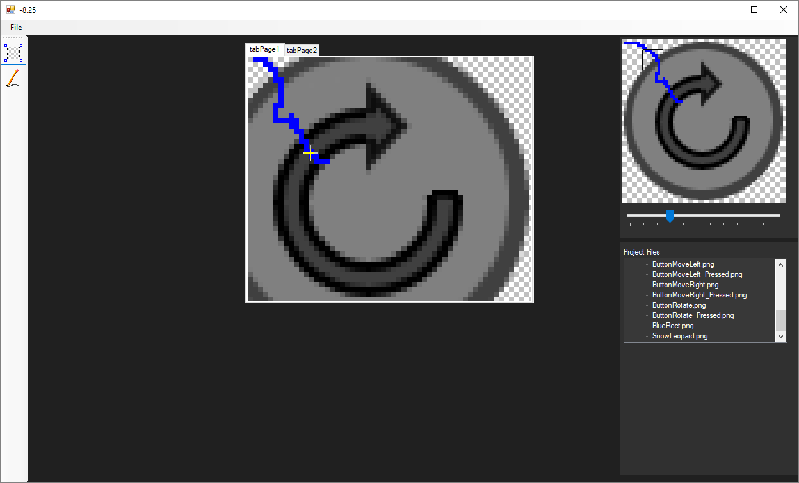
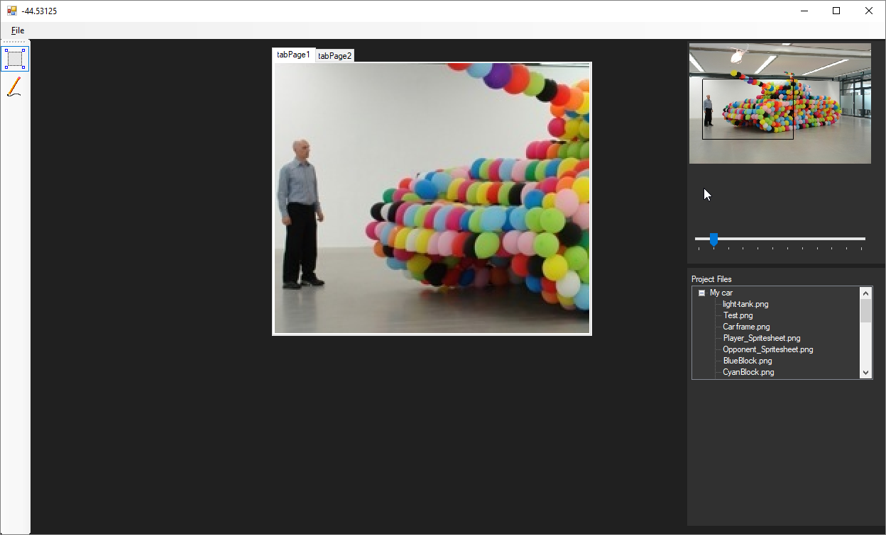

# GemPaint

First time I have attempted to create a pixel editor for creating sprites for game development. I wanted the editor to handle multiple images so I made a treeview to hold all images. Also, I thought it would be great to have a TDI (Tabbed Dialog Interface) so that the user could work on several images at the same time. I had planed to have a functional toolbar at the left side for typical drawing tools. On to the right we have the minimap for the active image and I wanted to simulate how a minimap works in a RTS-game. I probably should have revisited the math for the minimap, but my school semester was finished so I moved back to my home country, then the project was left in a halted state.

Tags: C#, Pixel Editor
